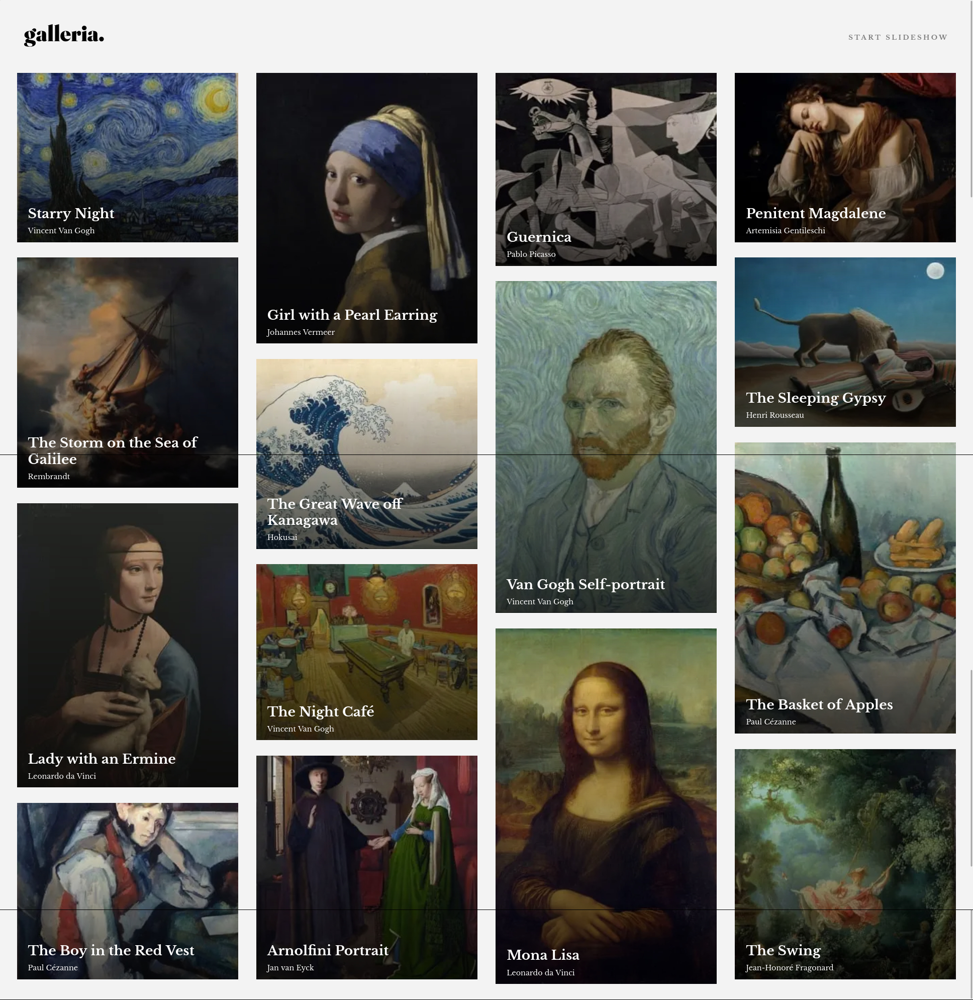

# Frontend Mentor - Galleria slideshow site solution

This is a solution to the [Galleria slideshow site challenge on Frontend Mentor](https://www.frontendmentor.io/challenges/galleria-slideshow-site-tEA4pwsa6). Frontend Mentor challenges help you improve your coding skills by building realistic projects.

## Table of contents

- [Overview](#overview)
  - [The challenge](#the-challenge)
  - [Screenshot](#screenshot)
  - [Links](#links)
- [My process](#my-process)
  - [Built with](#built-with)
  - [What I learned](#what-i-learned)
  - [Continued development](#continued-development)
  - [Useful resources](#useful-resources)
- [Author](#author)
- [Acknowledgments](#acknowledgments)

## Overview

### The challenge

Users should be able to:

- View the optimal layout for the app depending on their device's screen size
- See hover states for all interactive elements on the page
- Navigate the slideshow and view each painting in a lightbox

### Screenshot



### Links

- Solution URL: [Add solution URL here](https://github.com/ttsoares/galleria)
- Live Site URL: [Add live site URL here](https://galleria-five.vercel.app/)

## My process

### Built with

- Semantic HTML5 markup
- Tailwind customized properties
- [React](https://reactjs.org/) - JS library
- [Next.js](https://nextjs.org/) - React framework
- [tailwindCSS](https://tailwindcss.com/) - For styles

### What I learned

- How to handle the browser window object to obtain the width of it.

```js
const [windowSize, setWindowSize] = useState(getWindowSize());
function calc_progress_bar() {
  if (typeof window !== "undefined") {
    const step = windowSize / gall_size;
    setProgressBarr((position + 1) * step);
  }
}
function getWindowSize() {
  if (typeof window !== "undefined") {
    return window.innerWidth;
  } else return;
}
```

### Continued development

I was unable to place the 'CLOSE' button over the modal showing gallery image so place it in the middle. Maybe it is the NextJS tag <Image> that handle images. We can not control the size of the DOm object created by it.

### Useful resources

- [How to Get the Window's Width](https://bobbyhadz.com/blog/react-get-window-width-height) - Get window Width and Height in React

## Author

- Website - [Thomas Tschoepke Soares](https://www.linkedin.com/in/thomas-soares-6791781b/)
- Frontend Mentor - [@ttsoares](https://www.frontendmentor.io/profile/ttsoares)

## Acknowledgments

- [Tailwind CSS v3.2 Crash Course](https://www.youtube.com/watch?v=ei20HfTloFE) - Build a responsive conference landing page
